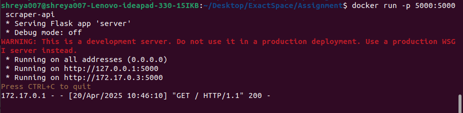

# Puppeteer Scraper + Flask Server (Multi-Stage Docker)

This project demonstrates the power of Node.js with Puppeteer for web scraping and Python with Flask for serving content—packaged in a lean multi-stage Docker container.

## Features
- Scrapes dynamic content (title & first 'h1') from any website using Puppeteer.

-  Uses Chromium installed via apt (no Puppeteer download overhead).

-  Serves scraped data using a Flask API.

-  Lightweight final image using Docker multi-stage builds.

-  Environment variable support for scraping any URL dynamically.

1. Scraper Stage (Node.js)

   - Installs Chromium.

   - Runs Puppeteer to scrape title and first h1 from  the specified URL.

   - Saves results in scraped_data.json.
  
- Create Dockerfile for  Multi-stage Docker build
  
  [Dockerfile](Dockerfile)

### Dockerfile Highlights
- Base images:

  - Node.js (node:18-slim) for Puppeteer

  - Python (python:3.10-slim) for Flask

- Puppeteer config:

  - Uses system-installed Chromium (apt) with 
```
PUPPETEER_SKIP_CHROMIUM_DOWNLOAD=true
```

- Multi-stage build keeps the final image small and production-ready.

- Create scrape.js	Puppeteer script to scrape the webpage

  [screape.js](scrape.js)

- Create server.py	Flask server to serve JSON output
  
   [server.py](server.py)

- Create package.json	Node.js dependencies for Puppeteer
   
   [package.json](package.json)

- Create requirements.txt	Python dependencies for Flask
   
   [requirements.txt](requirements.txt)


2. Serving Stage (Python + Flask)

    - Loads scraped_data.json.
    - Serves it over HTTP via a RESTful endpoint.
  
#### Build the Docker Image

```
docker build --build-arg SCRAPE_URL="https://example.com" -t scraper-api .
```


#### Run the Container
  
```
docker run -p 5000:5000 scraper-api 
```



#### Access the Data
   
   Open your browser or use curl:

   ```
       http://172.17.0.3:5000
   ```


#### Change the Target URL
  - Update the SCRAPE_URL during build:

```
docker build --build-arg SCRAPE_URL=https://en.wikipedia.org/wiki/Web_scraping -t puppeteer-flask-app .
```


- run the container 

```
docker run -p 5000:5000 puppeteer-flask-app
```


- Access the Data
   
   Open your browser or use curl: 

   ```
   http://172.17.0.3:5000
   ```

